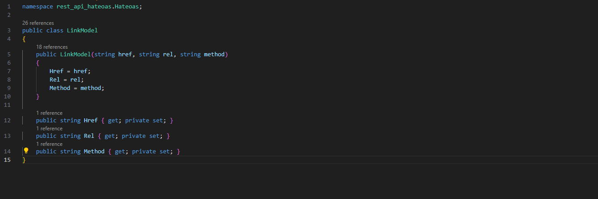

# rest-api-hateoas
Projeto com finalidade de aplicar classes para aplicar o nível de maturidade 3 (HATEOAS) em uma API Rest

Para rodar o projeto entre na pasta rest-api-hateoas e rode o comando docker compose up -d, a api irá rodar na porta 5105.

As classes criadas para o HATEOAS se encontram na pasta Hateoas, sendo elas LinkModel e ResourceHateoas

Classe LinkModel: Modelo para gerar os links dos recursos disponíveis na API e método para atualizar o rel para self quando for o recurso da vez
{width=100%; align=left}

Classe ResourceHateoas: Possui um método para retornar de forma dinâmica qualquer modelo de dados junto do array de LinkModel em formato de objeto 

Para utilização das classes foi criasdo um método na ProductsController onde recebe o Product e o recurso da vez, para criar a lista de recuros e gerar o retorno HATEOAS

O resultado da api com HATEOAS é o seguinte
